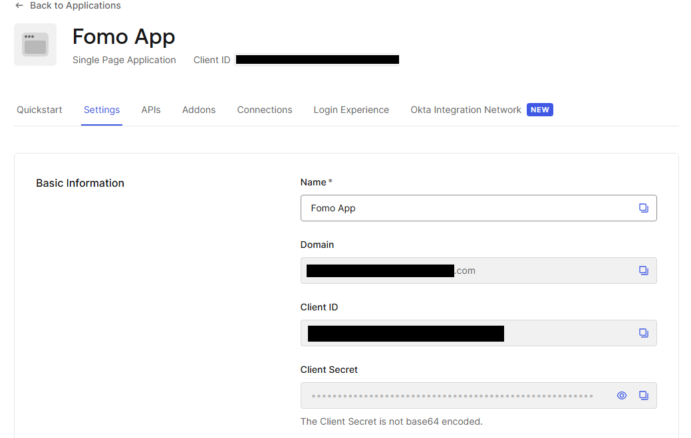
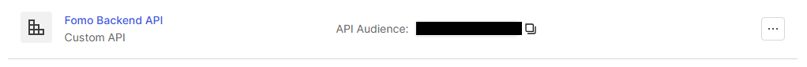
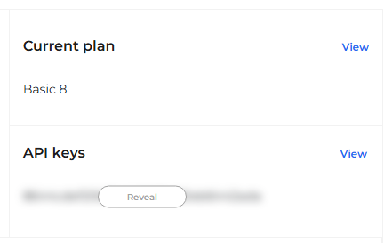

# 📊 Stock Analysis Platform - Backend

Backend API built with .NET 9 for a stock analysis platform, providing stock data processing, user management, a results board, and alerting features

---

## 🧠 Overview

This API is responsible for:

* Managing users
* Handling stock data and indicators
* Processing alerts
* Managing a shared results board

---

## 🚀 Tech Stack

* .NET 9 (Web API)
* Entity Framework Core
* PostgreSQL
* Auth0 (JWT Authentication)
* xUnit + FluentAssertions (Unit Testing)
* Docker

---

## 📦 Installation

Clone the repository:

```bash
git clone https://github.com/FOMO-financial-app/backend
cd backend
```

## 🏠 Option A — Run locally:
### Restore dependencies:

```bash
dotnet restore
```

### Run the application:

```bash
dotnet run --project FomoApp/Fomo.Api
```

## 📦 Option B — Run with Docker:
Make sure Docker Desktop is running, then:

```bash
docker compose up --build
```

---

## 🔌 Configuration

## 🏠 Running locally:

The application uses `appsettings.json` for configuration.

### Required settings:

### 🔑 Database connection string

For example: Host=localhost;Database=FomoAppDB;Username=your-user;Password=your-pass

### 🔑 Auth0 Domain and Audience

https://manage.auth0.com

* Get Auth0 Aplication Domain



* Get Auth0 API Audience



### 🔑 TwelveData API Key

https://twelvedata.com/login



### 🔑 Email service credentials

Go to:
Google Account → Security → 2-Step Verification → App passwords

### 🔑 Frontend URL  

## 📦Running with Docker:
Copy .env.example to .env and fill in your values:

```bash
cp .env.example .env
```

---

## 🗄️ Database

This project uses Entity Framework Core with PostgreSQL. Migrations are applied automatically on startup when running with Docker.

Applying migrations manually (local development):

```bash
dotnet ef database update --startup-project FomoApp/Fomo.Api --project FomoApp/Fomo.Infrastructure
```
Notes:
* A valid connection string must be provided
* The connection string is configured manually in the EFCoreDbContextFactory for design-time operations

---

## 🔐 Authentication

This API uses Auth0 with JWT-based authentication.

* Tokens are validated using Auth0
* Protected endpoints require a valid access token

---

## 📡 API Endpoints (examples)

| Method | Endpoint                           | Description                                           |
| ------ | ---------------------------------- | ----------------------------------------------------- |
| GET    | /api/Stocks/{page}/{pagesize}      | Get paginated list of stocks                          |
| GET    | /api/Stocks/timeseries             | Get detailed time series data for a stock             |
| POST   | /api/TradeResult/create            | Create a new trade result                             |
| DELETE | /api/TradeResult/{id}              | Delete a trade result                                 |
| PATCH  | /api/User/edit                     | Update user data                                      |
| GET    | /api/Indicators/sma                | Get SMA indicator for a stock                         |
| GET    | /api/Indicators/envelopes          | Get envelopes indicator for a specific stock          |

> ⚠️ Note: This is a simplified overview of the API. Additional endpoints are available in the project.

---

## 🧪 Testing

Unit tests are implemented for core business logic, specifically for financial indicator calculations.

* Framework: xUnit  
* Assertions: FluentAssertions  

To run tests:

```bash
dotnet test
```

---

## 📁 Project Structure

The project follows a layered architecture inspired by Clean Architecture principles:

```bash
FomoApp/
├── Fomo.Api/              # Presentation layer (controllers, config)
├── Fomo.Application/      # Business logic (services, DTOs)
├── Fomo.Domain/           # Core domain (entities)
├── Fomo.Infrastructure/   # External integrations (database, email, APIs)
```

🧅Layer Responsibilities:

* Fomo.Api
    Handles HTTP requests, routing, and application configuration
* Fomo.Application
    Contains business logic, use cases, and DTOs
* Fomo.Domain
    Defines core entities and domain models
* Fomo.Infrastructure
    Implements external services (database, email, third-party APIs)

---

## 🚀 Project Status

🟢 Completed (portfolio project)

---
